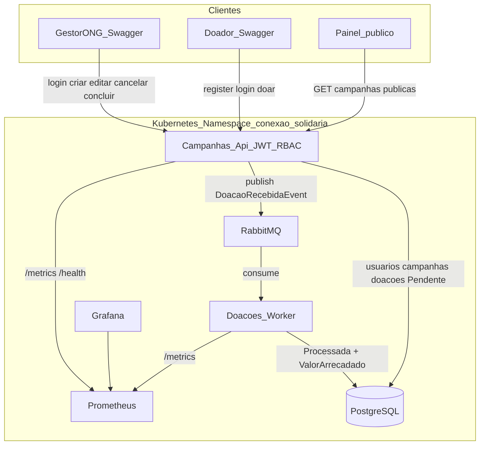

# Diagrama de Arquitetura — Conexão Solidária

Microsserviços, banco, broker e observabilidade no mesmo desenho:

## Microsserviços

| Serviço | Responsabilidade |
|---|---|
| **Campanhas.Api** | JWT/RBAC, cadastro de doador, gestão de campanhas (criar/editar/cancelar/concluir), painel público, recebe intenção de doação e **publica** evento |
| **Doacoes.Worker** | Consome fila RabbitMQ e atualiza `ValorArrecadado` — a API **nunca** incrementa o total |

## Fluxos (para explicar no vídeo)

### A) GestorONG (só API + Postgres)

1. Login → JWT com role `GestorONG`.
2. `POST /api/campanhas` cria campanha (`Ativa`).
3. `PUT /api/campanhas/{id}` edita ficha (incluindo Status, com regras).
4. `POST .../cancelar` ou `.../concluir` (ações explícitas).
5. Job na API fecha automaticamente campanhas com `DataFim` vencida.

Nada disso passa pelo Worker.

### B) Doador + doação assíncrona (obrigatório no vídeo)

1. Doador autentica e envia `POST /api/doacoes`.
2. API valida campanha `Ativa`, grava doação `Pendente` e publica `DoacaoRecebidaEvent`.
3. Mensagem aparece na fila `doacao.recebida.queue` (Management UI).
4. Worker processa, marca doação `Processada` e soma o valor na campanha.
5. `GET /api/campanhas/publicas` reflete o novo total arrecadado.

### C) Observabilidade

API e Worker expõem `/metrics` (e a API também `/health`). Prometheus coleta; Grafana desenha o dashboard.

## Persistência

Ver justificativa em [justificativa-bancos.md](justificativa-bancos.md) / [justificativa-bancos.pdf](justificativa-bancos.pdf).
