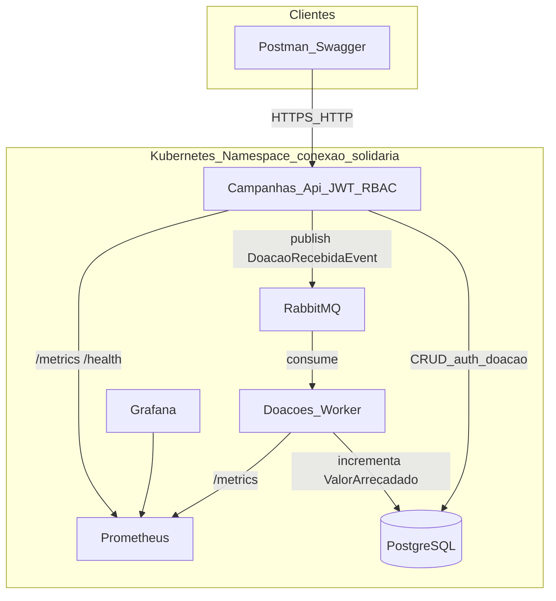

# Diagrama de Arquitetura — Conexão Solidária

## Microsserviços

| Serviço | Responsabilidade |
|---|---|
| **Campanhas.Api** | JWT/RBAC, cadastro de doador, gestão de campanhas, painel público, recebe intenção de doação e publica evento |
| **Doacoes.Worker** | Consome fila RabbitMQ e atualiza `ValorArrecadado` |

## Fluxo de doação (obrigatório no vídeo)

1. Doador autentica e envia `POST /api/doacoes`.
2. API valida campanha `Ativa`, grava doação `Pendente` e publica `DoacaoRecebidaEvent`.
3. Mensagem aparece na fila `doacao.recebida.queue` (Management UI).
4. Worker processa, marca doação `Processada` e soma o valor na campanha.
5. `GET /api/campanhas/publicas` reflete o novo total arrecadado.
